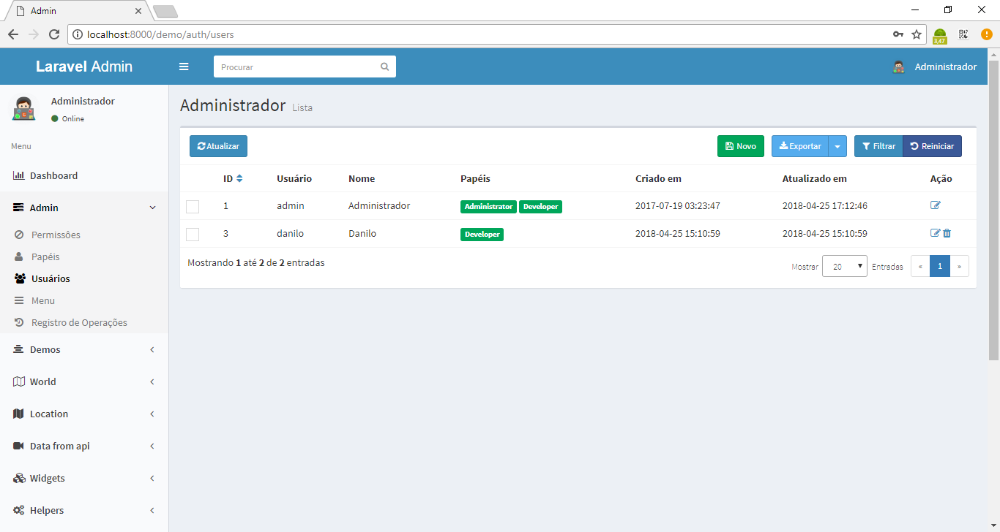
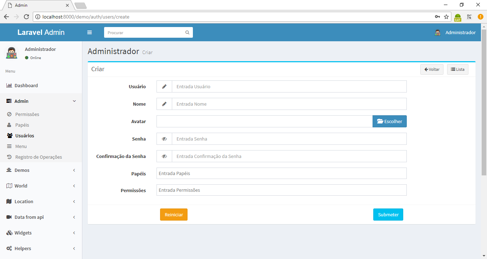
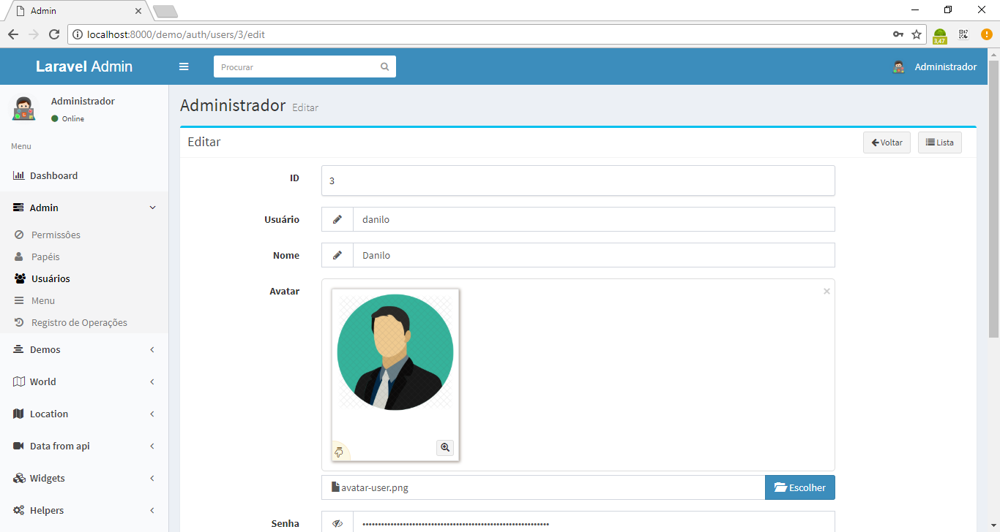
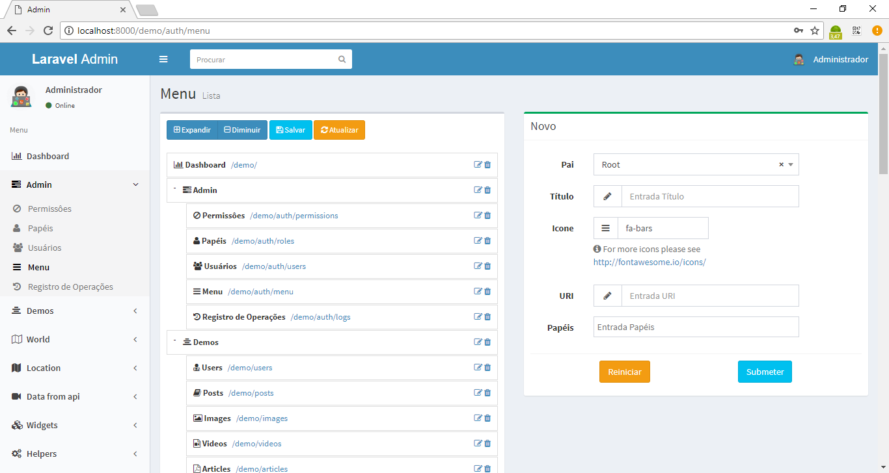
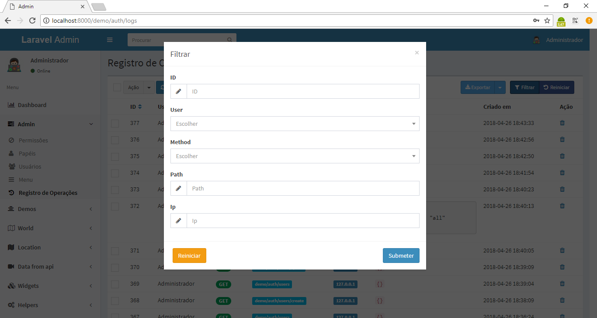

# Laravel Admin

Project of an Administrative Panel developed with the Laravel Framework 5.

## Features

- Auth
- ACL
- ORM
- Validator
- MultiLanguages
- Routes
- Grid View
- Pagination
- Export to Excel
- Flash Messages
- View Blade

## Requirements
- Apache
- PHP >= 5.5.9
- MySql >=5
- Composer

## Tecnologies

- PHP 7
- JS
- Jquery
- Json
- CSS and SCSS
- Bootstrap
- Composer
- Artisan

## Installation

```shell

$ git clone https://github.com/danilomeneghel/laravel_admin.git

$ cd laravel_admin

$ composer install -vvv

```

Then create a database with name `laravel_admin` in your mysql. You can find database dump in `storage/mysql_dump/laravel_admin_demo.sql`,  import it:

```sql

$ mysql -u <your user> -p <your password>

mysql> create database `laravel_admin`;

mysql> use `laravel_admin`;

mysql> source storage/mysql_dump/laravel_admin.sql

```

Back to terminal and start the web server:

```shell

$ php artisan serve

```

Finally open `http://localhost:8000/` in your browser.

## Connection

To be able to connect, I advise you to create an account on the panel.

  - You can use the default:
    User: admin
    Password: admin

## License

Laravel Admin is licensed under <a href="LICENSE">The MIT License (MIT)</a>.

## Screenshots

<br><br>
<br><br>
<br><br>
<br><br>
<br><br>
